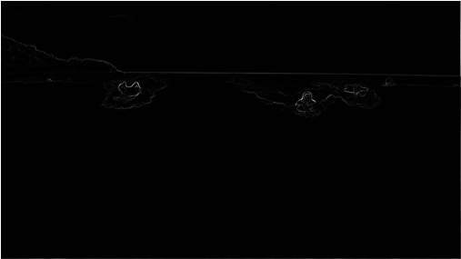

## Programming Assignment 2: Seam Carving

### Jump to the explanation of my [implementation](#solution)
  
Seam-carving is a content-aware image resizing technique where the image is reduced in size by one 
pixel of height (or width) at a time. 
A _vertical seam_ in an image is a path of pixels connected from the top to the bottom
with one pixel in each row.
(A _horizontal seam_ is a path of pixels connected from the left to the right
with one pixel in each column.)
Below left is the original 505-by-287 pixel image; below right is the result after removing
150 vertical seams, resulting in a 30% narrower image.
Unlike standard content-agnostic resizing techniques (e.g. cropping and scaling), the most 
interesting features (aspect ratio, set of objects present, etc.) of the image are preserved.

As you'll soon see, the underlying algorithm is quite simple and elegant.
Despite this fact, this technique was not discovered until 2007 by Shai Avidan and Ariel Shamir.
It is now a feature in Adobe Photoshop (thanks to a Princeton graduate student), as well
as other popular computer graphics applications.

In this assignment, you will create a data type that resizes a _W_-by-_H_ image using 
the seam-carving technique. 

Finding and removing a seam involves three parts and a tiny bit of notation:

1. _Notation._
In image processing, pixel (_x_, _y_) refers to the pixel in
column _x_ and row _y_, with
pixel (0, 0) at the upper left corner and pixel
(_W_ − 1, _H_ − 1) at the bottom right corner.
This is consistent with the
[Picture][0]
data type in stdlib.jar.
_Warning_: this is the opposite of the standard mathematical notation used in linear algebra
where (_i_, _j_) refers to row _i_ and column _j_ and with Cartesian
coordinates where (0, 0) is at the lower left corner.

_a 3-by-4 image_
(0, 0)  (1, 0)  (2, 0)  

(0, 1)  (1, 1)  (2, 1)  

(0, 2)  (1, 2)  (2, 2)  

(0, 3)  (1, 3)  (2, 3)  

We also assume that the color of a pixel is represented in RGB space, using three
integers between 0 and 255\.
This is consistent with the
[java.awt.Color][1] data type.

2. _Energy calculation._
The first step is to calculate the _energy_ of each pixel, which is a measure of the 
importance of each pixel---the higher the energy, the less likely that the pixel will be included 
as part of a seam (as we'll see in the next step).
In this assignment, you will implement the _dual gradient_ energy function, which is described below.
Here is the dual gradient of the surfing image above:

The energy is high (white) for pixels in the image where there is a rapid color gradient
(such as the boundary between the sea and sky and the boundary between the surfing Josh Hug 
on the left and the ocean behind him). The seam-carving technique avoids removing such high-energy pixels.

3. _Seam identification._
The next step is to find a vertical seam of minimum total energy.
This is similar to the classic shortest path problem
in an edge-weighted digraph except for the following:

  * The weights are on the vertices instead of the edges.

  * We want to find the shortest path from any of the _W_ pixels in the top row
to any of the _W_ pixels in the bottom row.

  * The digraph is acyclic, where there is a downward edge from pixel
(_x_, _y_) to pixels 
(_x_ − 1, _y_ + 1),
(_x_, _y_ + 1), and
(_x_ + 1, _y_ + 1),
assuming that the coordinates are in the prescribed range.

4. _Seam removal._
The final step is to remove from the image all of the pixels along the seam.

**The SeamCarver API.** Your task is to implement the following mutable data type:

>     public class SeamCarver {
>        public SeamCarver(Picture picture)
>        public Picture picture()                       // current picture
>        public     int width()                         // width  of current picture
>        public     int height()                        // height of current picture
>        public  double energy(int x, int y)            // energy of pixel at column x and row y in current picture
>        public   int[] findHorizontalSeam()            // sequence of indices for horizontal seam in current picture
>        public   int[] findVerticalSeam()              // sequence of indices for vertical   seam in current picture
>        public    void removeHorizontalSeam(int[] a)   // remove horizontal seam from current picture
>        public    void removeVerticalSeam(int[] a)     // remove vertical   seam from current picture
>     }
>     
> 
> 

* **Constructor.**
The data type may not mutate the Picture argument to the constructor.

* **Computing the energy of a pixel.** We will use the _dual gradient energy function_: The
energy of pixel (_x_, _y_) is
Δ_x_2(_x_, _y_) + Δ_y_2(_x_, _y_),
where the square of the _x-_gradient
Δ_x_2(_x_, _y_) = _Rx_(_x_, _y_)2
+ _G_x__(_x_, _y_)2
+ _B_x__(_x_, _y_)2,
and where the central differences
_Rx_(_x_, _y_),
_Gx_(_x_, _y_), and
_Bx_(_x_, _y_)
are the absolute value in differences of red, green, and blue components between
pixel (_x_ + 1, _y_) and pixel (_x_ − 1, _y_). 
The square of the _y_-gradient Δ_y_2(_x_, _y_)
is defined in an analogous manner.
We define the energy of pixels at the border of the image to be
2552 + 2552 + 2552 = 195075\.

As an example, consider the 3-by-4 image with RGB values (each component is an integer between 0 and 255)
as shown in the table below.
(255, 101, 51)  (255, 101, 153)  (255, 101, 255)  

(255,153,51)  (255,153,153)  (255,153,255)  

(255,203,51)  (255,204,153)  (255,205,255)  

(255,255,51)  (255,255,153)  (255,255,255)  

The ten border pixels have energy 195075\. Only the pixels (1, 1) and (1, 2) are nontrivial.
We calculate the energy of pixel (1, 2) in detail:

_Rx_(1, 2) = 255 − 255 = 0,   
_Gx_(1, 2) = 205 − 203 = 2,   
_Bx_(1, 2) = 255 − 51 = 204,   
yielding Δ_x_2(1, 2) = 22 + 2042 = 41620\. 

_Ry_(1, 2) = 255 − 255 = 0,   
_Gy_(1, 2) = 255 − 153 = 102,   
_By_(1, 2) = 153 − 153 = 0,   
yielding Δ_y_2(1, 2) = 1022 = 10404\. 

Thus, the energy of pixel (1, 2) is 41620 + 10404 = 52024\.
Similarly, the energy of pixel (1, 1) is 2042 + 1032 = 52225\.
195075.0 195075.0 195075.0 

195075.0 52225.0 195075.0 

195075.0 52024.0 195075.0 

195075.0 195075.0 195075.0 

  
* **Finding a vertical seam.**
The findVerticalSeam() method should return an array of length _H_ such that entry
_x_ is the column number of the pixel to be removed from row _x_ of the image.
For example, consider the 6-by-5 image below (supplied as [6x5.png][2]).

( 97, 82,107) (220,172,141) (243, 71,205) (129,173,222) (225, 40,209) ( 66,109,219) 

(181, 78, 68) ( 15, 28,216) (245,150,150) (177,100,167) (205,205,177) (147, 58, 99) 

(196,224, 21) (166,217,190) (128,120,162) (104, 59,110) ( 49,148,137) (192,101, 89) 

( 83,143,103) (110, 79,247) (106, 71,174) ( 92,240,205) (129, 56,146) (121,111,147) 

( 82,157,137) ( 92,110,129) (183,107, 80) ( 89, 24,217) (207, 69, 32) (156,112, 31) 

The corresponding pixel energies are shown below, with a minimum energy vertical seam highlighted in red.
In this case, the method findVerticalSeam() should return the array { 2, 3, 3, 3, 2 }.

195075.0
195075.0
195075.0
195075.0
195075.0
195075.0

195075.0
23346.0
51304.0
31519.0
55112.0
195075.0

195075.0
47908.0
61346.0
35919.0
38887.0
195075.0

195075.0
31400.0
37927.0
14437.0
63076.0
195075.0

195075.0
195075.0
195075.0
195075.0
195075.0
195075.0

When there are multiple vertical seams with minimal total energy (as in the example above),
your method can return any such seam.
* 
**Finding a horizontal seam.**
The behavior of findHorizontalSeam() is analogous to that of findVerticalSeam()
except that it should return an array of length _W_ such that entry _y_
is the row number of 
the pixel to be removed from column _y_ of the image.
* 
**Performance requirements.**
The width(), height(), and energy() methods should take constant time in the worst case.
All other methods should run in time at most proportional to _W H_ in the worst case.
For faster performance, do not construct explicit DirectedEdge and
EdgeWeightedDigraph objects.
* 
**Exceptions.** Your code should throw an exception when called with invalid arguments.

  * By convention, the indices _x_ and _y_ are integers between 0 and _W_ − 1 and between
0 and _H_ − 1 respectively.
Throw a java.lang.IndexOutOfBoundsException if either _x_ or _y_
is outside its prescribed range.

  * Throw a java.lang.IllegalArgumentException if removeVerticalSeam() or
removeHorizontalSeam() is called with an array of the wrong length
or if the array is not a valid seam (i.e., either an entry is outside its prescribed range
or two adjacent entries differ by more than 1).

  * Throw a java.lang.IllegalArgumentException if either removeVerticalSeam() or
removeHorizontalSeam() is called when either the width or height is less than
or equal to 1\.

**Analysis of running time (optional and not graded).**

* Give the worst-case running time to remove _R_ rows and _C_ columns from a _W_-by-_H_
image as a function of _R_, _C_, _W_, and _H_.

* Estimate empirically the running time (in seconds) to remove _R_ rows and _C_ columns 
from a _W_-by-_H_ image as a function of _R_, _C_, _W_, and 
_H_. Use tilde notation to simplify your answer.

**Submission.**
Submit SeamCarver.java, and any other files needed by your program (excluding those
in stdlib.jar and algs4.jar).
Your may not call any library functions other than those in java.lang,
java.util, java.awt.Color, stdlib.jar, and algs4.jar.

This assignment was developed by Josh Hug, Maia Ginsburg, and Kevin Wayne.

## Solution

[0]: http://introcs.cs.princeton.edu/java/stdlib/Picture.java.html
[1]: http://docs.oracle.com/javase/6/docs/api/java/awt/Color.html
[2]: http://coursera.cs.princeton.edu/algs4/testing/seamCarving/6x5.png
